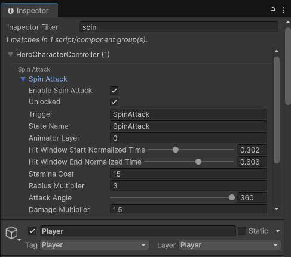

# Unity Inspector Filter

`com.budorf.unityinspectorfilter` adds a search field to the top of each Unity Inspector window.

When you type a query, the package scans the current selection's serialized properties and shows matching fields in a filtered results pane grouped by parent script or component. If a field lives under a serialized parent path or a `Header` section, that context is shown above the matching field.

## Package Layout

- `Editor/InspectorFilterBootstrap.cs`: editor bootstrap and inspector UI injection
- `Editor/UnityInspectorFilter.Editor.asmdef`: editor-only assembly definition
- `package.json`: UPM metadata

## Installation

Reference the package from your Unity project manifest:

```json
"com.budorf.unityinspectorfilter": "https://github.com/mdj128/unity-inspector-filter.git"
```

## Screenshot



## Current behavior

- Works as an editor-only UPM package.
- Injects a search field into every open Inspector window.
- For `GameObject` selections, searches all attached components.
- For non-`GameObject` selections, searches the selected object's serialized fields.
- Shows the matching component or script as the parent group.
- Shows `HeaderAttribute` text when present, otherwise the serialized parent path.

## Limitation

This package adds a filtered results pane at the top of the inspector. It does not try to rewrite Unity's built-in inspector drawing pipeline or hide every non-matching control from arbitrary custom editors.

That tradeoff keeps the package self-contained and UPM-friendly while still making deep inspectors much easier to search.

## Development Notes

- The package currently targets Unity `6000.2` per `package.json`.
- The implementation avoids patching Unity internals and instead attaches UI Toolkit content into the inspector visual tree.
- Runtime validation still needs to happen inside Unity because this repository does not include an automated editor test harness yet.
